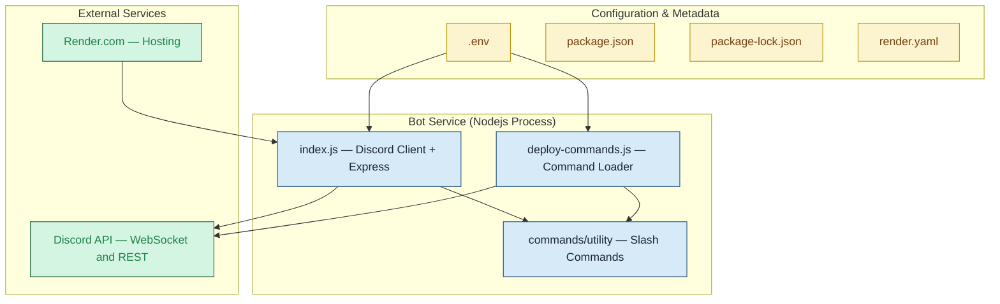

# 🤖 Discord Bot with Slash Commands and Web Interface

A modular Discord bot built with `discord.js` v14 and `express`, supporting slash commands organized by categories. Includes a web service endpoint to keep the bot alive on platforms like Render.

---

## 📁 Project Structure

```
.
├── commands/
│   └── utility/        # Contains utility slash commands (e.g. /ping, /greet, /dice, etc.)
├── deploy-commands.js  # Registers commands with Discord
├── index.js            # Main bot file with Discord client and express server
├── package.json        # Project metadata and dependencies
├── render.yaml         # Render deployment configuration
└── .env                # Environment variables (TOKEN, CLIENTID, GUILDID)
```

---

## ⚙️ Features

- **Slash Commands**: Organized using folders for better scalability.
- **Utility Commands**: `/ping`, `/greet`, `/8ball`, `/dice`, `/predict`, `/remindme`, `/define`, `/motivate`, `/roast`, `/server`, `/user`.
- **Auto Command Registration**: Automatically registers all commands on startup.
- **Express Server**: Basic HTTP server to respond to pings (e.g. for uptime bots).
- **Render Deployment Ready**: Easily deployable using Render with `render.yaml`.

---

## 🚀 Setup Instructions

### 1. Clone the Repo

```bash
git clone https://github.com/yourusername/discord-bot.git
cd discord-bot
```

### 2. Install Dependencies

```bash
npm install
```

### 3. Add Environment Variables

Create a `.env` file (or set via your hosting platform):

```env
TOKEN=your_discord_bot_token
CLIENTID=your_discord_application_client_id
GUILDID=your_test_server_id
PORT=3000
```

> These are also defined in `render.yaml` for Render deployment.

### 4. Register Commands (Optional if using index.js logic)

```bash
node deploy-commands.js
```

### 5. Start the Bot

```bash
node index.js
```

---

## 🌐 Deploy to Render

> Already set up with `render.yaml` — push to GitHub and connect it to Render.

### 1. Commit to GitHub  
Push your code to a GitHub repository.

### 2. Create Web Service  
On [Render.com](https://render.com/), create a new Web Service and link your GitHub repo.

### 3. Add Environment Variables  
Add the following under "Environment":

- `TOKEN`
- `CLIENTID`
- `GUILDID`

### 4. Done!  
Render will build and host your bot automatically.

---

## 🧭 Architecture Diagram



---

## 🧩 Example Commands

- `/ping` – Check latency
- `/remindme` – Set a timed reminder
- `/roast` – Light-hearted roasts
- `/define` – Get simple word definitions
- `/user` – Get your Discord tag and ID

---

## 🛠️ Built With

<p align="left">
  
  
  
  
  
  
</p>

---

## 📄 License

ISC © 2025

---

## 🙌 Credits

Created with ❤️ for learning and fun Discord automation.
